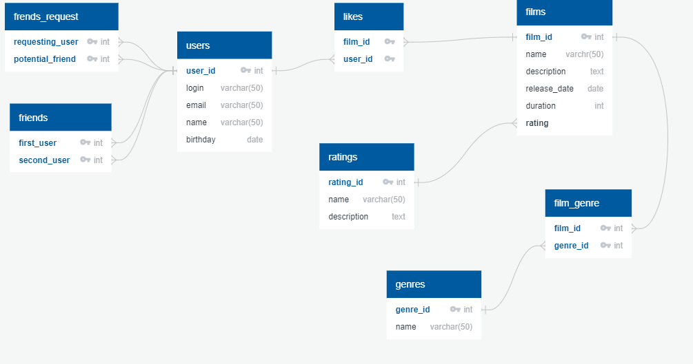

# Схема базы данных

# Описание БД
### users
Таблица содержит информацию о пользователях
### rating
Содержит информацию о рейтингах фильмов
### genres 
Содержит информацию о жанрах
### film_genre
Служит для обеспечения связи многие ко многим между таблицами фильмов и жанров
### likes
Служит для обеспечения связи многие ко многим между таблицами фильмов и пользователей.  
Содержит информацию о лайках, которые пользователи ставят фильмам
### friends
Содержит информацию о дружбе между пользователями.  
Запись a-b означает, что a является другом b и b является другом a
### friends_request 
Содержит информацию о запросах дружбы между пользователями
Запись a-b означает, что a запрашивает дружбу у b

# Примеры запросов к БД
## Поиск друзей пользователя с id =1
SELECT  
CASE WHEN first_user = 1 THEN second_user  
WHEN second_user = 1 THEN first_user  
END AS friends  
FROM friends  
WHERE first_user = 1 OR second_user = 1  
---
## Общие друзья пользователей с id = 1,4
SELECT  
f_F.friends  
FROM (SELECT  
CASE WHEN first_user = 1 THEN second_user  
WHEN second_user = 1 THEN first_user  
END AS friends  
FROM friends  
WHERE first_user = 1 OR second_user = 1) AS f_f  
LEFT JOIN friends AS f ON (f.first_user = f_f.friends OR f.second_user = f_f.friends)  
WHERE f.first_user = 4 OR f.second_user = 4  

---
## Исходящие заявки в друзья от пользователя 1
SELECT potential_friend  
FROM friends_request  
WHERE requesting_user = 1  
---
## Входящие заявки в друзья пользователя с id = 3
SELECT requesting_user  
FROM friends_request  
WHERE potential_friend = 3  
---
## Топ 10 фильмов по лайкам
SELECT film_id  
FROM likes  
GROUP BY film_id  
ORDER BY count(user_id) DESC  
LIMIT 10 