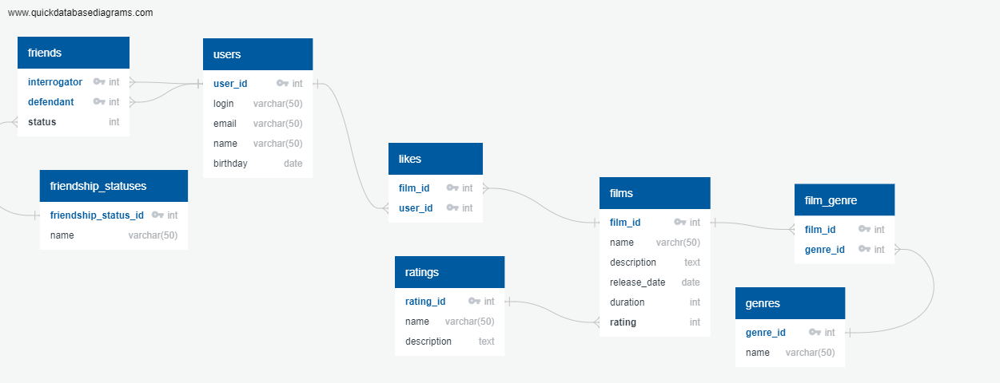

# Схема базы данных

# Описание БД
### users
Таблица содержит информацию о пользователях
### rating
Содержит информацию о рейтингах фильмов
### genres 
Содержит информацию о жанрах
### film_genre
Служит для обеспечения связи многие ко многим между таблицами фильмов и жанров
### likes
Служит для обеспечения связи многие ко многим между таблицами фильмов и пользователей.  
Содержит информацию о лайках, которые пользователи ставят фильмам
### friends
Содержит информацию о дружбе между пользователями.  
Запись a-b означает, что a является другом b и b является другом a
### friends_request 
Содержит информацию о запросах дружбы между пользователями
Запись a-b означает, что a запрашивает дружбу у b

# Примеры запросов к БД
## Поиск друзей пользователя с id =1  
SELECT
CASE WHEN interrogator = 1 THEN defendant
WHEN defendant = 1 THEN interrogator
END AS friends
FROM friends AS f
JOIN friendship_statuses AS s ON f.status = s.id
WHERE (f.interrogator = 1 OR f.defendant = 1) AND s.name = 'accept'

---
## Общие друзья пользователей с id = 1,4   
SELECT
f_f.friends
FROM (SELECT
CASE WHEN interrogator = 1 THEN defendant
WHEN defendant = 1 THEN interrogator
END AS friends
FROM friends AS f
JOIN friendship_statuses AS s ON f.status = s.id
WHERE (f.interrogator = 1 OR f.defendant = 1) AND s.name = 'accept') AS f_f
LEFT JOIN friends AS f ON (f.interrogator = f_f.friends OR f.defendant = f_f.friends)
LEFT JOIN friendship_statuses AS s ON f.status = s.id
WHERE (f.interrogator = 4 OR f.defendant = 4)  AND s.name = 'accept'

---
## Исходящие заявки в друзья от пользователя 1  
SELECT f.defendant
FROM friends AS f
JOIN friendship_statuses AS s ON f.status=s.id
WHERE f.interrogator = 1 AND s.name = 'request'

---
## Входящие заявки в друзья пользователя с id = 3  
SELECT f.interrogator
FROM friends AS f
JOIN friendship_statuses AS s ON f.status=s.id
WHERE f.defendant = 4 AND s.name = 'request'

---
## Топ 10 фильмов по лайкам  
SELECT film_id  
FROM likes  
GROUP BY film_id  
ORDER BY count(user_id) DESC  
LIMIT 10 